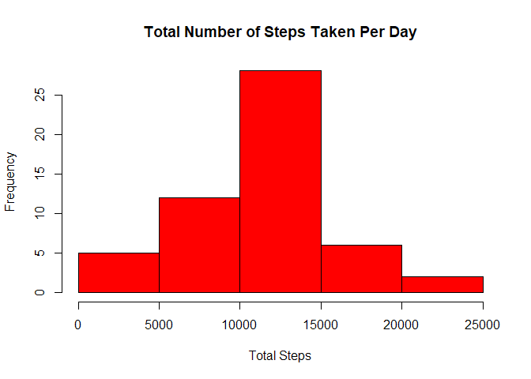

## **Initial Analysis**

### *Download, unzip, and read data*

```r
if(!file.exists("./ActMonDat.zip")) {
  fileUrl <- "https://d396qusza40orc.cloudfront.net/repdata%2Fdata%2Factivity.zip"
  download.file(fileUrl, destfile = "./ActMonDat.zip", method = "curl")
}

if(!file.exists("activity.csv")) {
  unzip(zipfile = "./ActMonDat.zip")
}

amd <- read.csv("activity.csv", colClasses=c('numeric', 'character', 'numeric'))
```

### *Histogram*

```r
agg_amd <- aggregate(steps ~ date, amd, sum, na.rm=TRUE)

hist(agg_amd$steps, col='red', xlab='Total Steps', main='Total Number of Steps Taken Per Day')
```

<!-- -->

### *Mean*

```r
mean(agg_amd$steps)
```

```
## [1] 10766.19
```

### *Median*

```r
median(agg_amd$steps)
```

```
## [1] 10765
```

### *Time-Series*

```r
int_amd <- aggregate(steps ~ interval, amd, mean, na.rm=TRUE)

plot(int_amd, type='l', col='red', xlab='Interval', ylab='Steps', main='Average Number of Steps Per Interval')
```

<!-- -->

### *5-minute interval that, on average, contains the maximum number of steps*

```r
subset(int_amd, int_amd$steps==max(int_amd$steps))$interval
```

```
## [1] 835
```


## **Replacing Missing Values**

### *Total Number of Missing Values*

```r
sum(is.na(amd))
```

```
## [1] 2304
```

### *Replacing missing values with the overall average for each corresponding 5-minute interval*

```r
rep_na_amd <- numeric()
for (i in 1:nrow(amd)) {
  na_amd <- amd[i,]
  if (is.na(na_amd$steps)) {
    steps <- subset(int_amd, interval==na_amd$interval)$steps
  } else {
    steps <- na_amd$steps
  }
  rep_na_amd <- c(rep_na_amd, steps)
}

noNA_amd <- amd
noNA_amd$steps <- rep_na_amd
```

### *Total Number of Missing Values after replacement*

```r
sum(is.na(noNA_amd))
```

```
## [1] 0
```

### *Histogram*

```r
agg_noNA_amd <- aggregate(steps ~ date, noNA_amd, sum, na.rm=TRUE)

hist(agg_noNA_amd$steps, col='blue', xlab='Total Steps', main='Total Number of Steps Taken Per Day')
```

<!-- -->

### *Mean*

```r
mean(agg_noNA_amd$steps)
```

```
## [1] 10766.19
```

### *Median*

```r
median(agg_noNA_amd$steps)
```

```
## [1] 10766.19
```

## **Comparing weekdays to weekends**

```r
library(lattice)
amd$date <- as.Date(amd$date, '%Y-%m-%d')
dow <- weekdays(amd$date)
level <- c()
for (i in 1:nrow(amd)) {
  if (dow[i]=="Saturday") {
    level[i] <- "weekend"
  }
  else if (dow[i]=="Sunday") {
    level[i] <- "weekend"
  }
  else {
    level[i] <- "weekday"
  }
}
amd$level <- level
```

### *Plots*

```r
weekday_amd <- subset(amd, amd$level=='weekday')
weekend_amd <- subset(amd, amd$level=='weekend')

agg_wday_amd <- aggregate(steps~interval, weekday_amd, mean)
agg_wend_amd <- aggregate(steps~interval, weekend_amd, mean)
```

#### *Overlay*

```r
plot(agg_wday_amd, type='l', col='red', main='Weekdays vs. Weekends')
lines(agg_wend_amd, col='blue')
legend('topright', legend=c('Weekdays', 'Weekends'), lty=1, col=c('red', 'blue'))
```

<!-- -->

#### *Side-by-Side*

```r
par(mfrow=c(1,2))
par(cex=0.5)
par(cex.axis=1.5)
par(cex.lab=1.5)
par(cex.main=1.5)
plot(agg_wday_amd, type='l', col='red', main='Weekdays')
plot(agg_wday_amd, type='n', main='Weekends')
lines(agg_wend_amd, col='blue')
```

<!-- -->

```r
dev.off()
```

```
## null device 
##           1
```

#### *Top-and-Bottom*

```r
par(mfrow=c(2,1))
par(cex=0.5)
plot(agg_wday_amd, type='l', col='red', main='Weekdays')
plot(agg_wday_amd, type='n', main='Weekends')
lines(agg_wend_amd, col='blue')
```

<!-- -->

```r
dev.off()
```

```
## null device 
##           1
```

